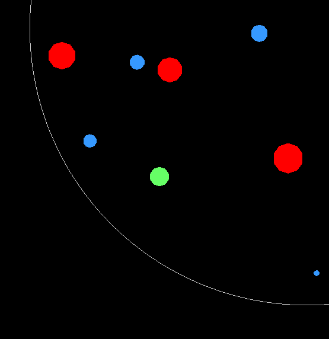

--------------------------------------
Real-time Rendering Assignment 3, 2012
--------------------------------------

Submitted By:
	Alyssa Biasi and Christopher Stojanovic

Instructions
------------
You are the green blob. The aim is to absorb the blobs smaller than you (the 
blue ones) to become the biggest blob, while avoiding the larger ones (the 
red ones).

You will lose if a larger blob catches you or it is no longer possible for you 
to become the biggest.

The second level contains a *smart* blob. A smaller smart blob will run away 
from you. A larger on will chase you.

Controls
--------
- Click to move.
- ESC / 'q' => quit
- 'w' => toggle wireframe
- 'p' => pause game
- 'd' => toggle grid collision checking & brute force (default = grid)

What is it?
-----------
The purpose of this assignment was to learn about game physics and collisions. 
This was achieved by creating a basic replica of the game Osmos_.

.. _Osmos: http://www.hemispheregames.com/osmos/

Compile Instructions
--------------------
``make all`` to compile.

``./ass3`` to run.

``make clean`` to remove objects and executable.
